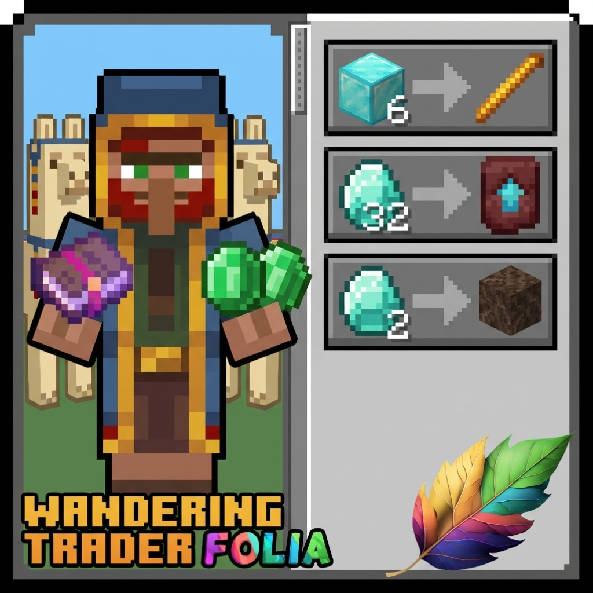

# WanderingTrader

A lightweight Paper/Folia plugin to fully customize Wandering Trader trades with weighted randomization.

## Features

- **Full Trade Customization** — Define custom trades with any items, prices, and amounts
- **Weighted Randomization** — Control trade rarity with configurable weights
- **Folia Native Support** — Built for Folia's regionized multithreading from the ground up
- **Paper Compatible** — Works on regular Paper servers too
- **Enchanted Books** — Support for trading enchanted books with any enchantment
- **Hot Reload** — Reload configuration without server restart

## Requirements

- Paper 1.21.4+ or Folia 1.21.4+
- Java 21+

## Installation

1. Download the latest release from [Modrinth](https://modrinth.com/plugin/wandering-trader-folia)
2. Place the JAR file in your server's `plugins` folder
3. Restart your server
4. Configure trades in `plugins/WanderingTrader/config.yml`

## Commands

| Command | Description | Permission |
|---------|-------------|------------|
| `/wt reload` | Reload configuration | `wanderingtrader.admin` |
| `/wt list` | List all configured trades | `wanderingtrader.admin` |
| `/wt info` | Show plugin settings | `wanderingtrader.admin` |

**Aliases:** `/wanderingtrader`, `/trader`

## Configuration

### Settings

```yaml
settings:
  min-trades: 5              # Minimum trades per Wandering Trader
  max-trades: 8              # Maximum trades per Wandering Trader
  replace-all-trades: true   # true = only custom trades, false = add to vanilla
```

### Trade Format

```yaml
trades:
  my_trade:
    enabled: true
    result:
      material: DIAMOND_SWORD    # What the trader sells
      amount: 1
    cost:
      material: EMERALD          # What the player pays
      amount: 32
    max-uses: 3                  # Uses before trade locks
    weight: 10                   # Higher = more likely to appear
```

### Enchanted Books

```yaml
trades:
  mending_book:
    enabled: true
    result:
      material: ENCHANTED_BOOK
      amount: 1
    cost:
      material: EMERALD
      amount: 20
    enchantments:
      MENDING: 1
    max-uses: 1
    weight: 5
```

## Building from Source

```bash
mvn clean package
```

The compiled JAR will be in `target/WanderingTrader-1.0.0.jar`

## Folia Compatibility Notes

This plugin is built with Folia support from the start:
- No main thread dependencies
- Thread-safe event handling
- Compatible with regionized multithreading

## Notice
Code fully written using Anthropic's Opus 4.5 (AI) for the needs of my private server.  
There was no folia supported plugins for wandering trader on Modrith, so I decided to polish up the plugin and make it publicly available.

## License

MIT License
